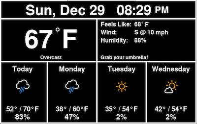
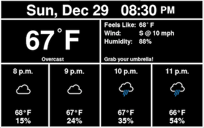
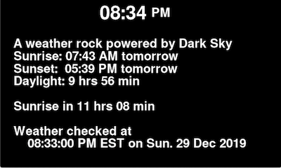

{}
On March 30, 2020 an announcement was posted to the [Dark Sky Blog](https://blog.darksky.net) stating that they have
been acquired by Apple. The announcement went on to say that they are no longer accepting new requests for API access and that they
will be shutting the API down at the end of 2021.

This unfortunate bit of news isn't the end of this project... I've been here before. This just means that I will have to do a third
API migration. I have decided to use [ClimaCell](https://www.climacell.co/weather-api/) as the new backend. This is actually
going to enable some new features. Work related to this, and suggestions on what API to use, are being tracked in
[issue 48](https://github.com/genebean/PiWeatherRock/issues/48) of the project's GitHub repo.
{}

## Welcome

Welcome to the documentation for PiWeatherRock! I'm glad you have decided to check it out and sincerely hope you find it useful.

PiWeatherRock is packaged as a series of Python packages that can be installed from [PyPI](https://pypi.org). To maximize the usefulness of these packages it helps if the program runs as a service. To facilitate this, along with the installation of all prerequisite software, I have taken advantage of the open source automation tools from [Puppet](https://puppet.com/open-source/).

## Screens

PiWeatherRock has three screens that it cycles through to show you a daily forecast, a hourly forecast, and an information screen. Here are examples of each:

| Daily forecast                                         | Hourly forecast                                          | Info screen                                 |
|--------------------------------------------------------|----------------------------------------------------------|---------------------------------------------|
|  |  |  |

Data for these forecasts is pulled from Dark Sky via their free API.

## Ready to get started?

Find out how to install PiWeatherRock in [Getting Started](getting-started/).

## Ready to update?

Check out the [Getting Updates](getting-updates/) section for details on how to upgrade to the latest version.

## Got feedback?

Head over to the [Contributing](contributing/) section to learn how to share your thoughts on PiWeatherRock or to the documentation on this site.
